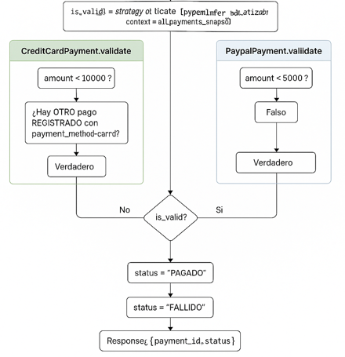

## ISyD_Parcial - Gonzalo Paredes y David Tobares - 25.10.25
## Estructura del repositorio y responsabilidades

```
├─ .github/workflows/
│  ├─ ci_pipeline.yml        # CI: corre tests automáticamente en cada PR → main
│  └─ cd_release.yml         # CD: despliegue automático al hacer merge a production
├─ clases/
│  ├─ paymentStategy.py      # (base/intefaz de estrategia de pago: patrón Strategy)
│  ├─ creditCardPayment.py   # Estrategia: reglas de Tarjeta de Crédito
│  └─ paypalPayment.py       # Estrategia: reglas de PayPal
├─ tests/
│  └─ test_payments.py       # Tests unitarios de la API y reglas de negocio
├─ .gitignore                # Archivos/Carpetas ignoradas por Git (venv, __pycache__, etc.)
├─ README.md                 # Este documento muestra la documentación de nuestro proyecto 
├─ requirements.txt          # Dependencias
├─ data.json                 # “Mini-DB” en JSON (persistencia simple para la demo)
├─ data_repository.py        # Se agrega data_repository el cual separa la logica de acceso a la db. Nos permite que un objeto no pueda tener acceso ilimitado a la base de datos y separar responsabilidades.
└─ main.py                   # App FastAPI: endpoints
```

# Descripción de la Estructura
## Main.py

Contiene la aplicación FastAPI. Define los endpoints de la API y, cuando se requiere validar/ejecutar un pago, selecciona la estrategia apropiada en función de payment_method (ej.: "credit_card", "paypal"). 

## URL de API
https://isyd-parcial.onrender.com/docs

## Data.json

Archivo JSON usado como persistencia simple (clave = payment_id). Útil para esta práctica: evita montar una base de datos. En un entorno productivo real se reemplazaría por una DB real.

## Data_repository.py
Se agrega el archivo data_repository el cual separa la logica de acceso a la db. Nos permite que un objeto no pueda tener acceso ilimitado a la base de datos y separar responsabilidades. Se encarga de lectura y escritura de datos. 

## Clases/paymentStategy.py
Define la interfaz/base del Patrón Strategy (por ej., métodos validate(...). Esto permite abrir el sistema a nuevos medios de pago sin tocar la lógica del resto de la app.

Nota: el archivo se llama paymentStategy.py

## Clases/creditCardPayment.py
Implementa la estrategia de Tarjeta de Crédito. Reglas típicas de la consigna:

Monto < 10.000.

No puede haber más de 1 pago con este medio en estado REGISTRADO.

## Clases/paypalPayment.py
Implementa la estrategia de PayPal. Regla principal:

Monto < 5.000.

## Tests

### tests/test_payments.py
Conjunto de tests unitarios (PyTest) para endpoints y reglas de negocio.  
Se ejecutan:
- localmente con `pytest -q` desde el root del proyecto
- automáticamente en CI vía GitHub Actions

### .github/workflows/ci_pipeline.yml
Pipeline de CI: al crear un Pull Request hacia `main`, instala dependencias y ejecuta los tests.  
El estado de los checks aparece directamente en el PR (bloquea merges si falla).

### .github/workflows/cd_release.yml
Pipeline de CD / Release: al crear un tag `v*.*.*`, genera un Release y adelanta la rama `production` hasta ese tag.  
Render está configurado para desplegar automáticamente cada vez que `production` cambia, por lo que esto publica la versión.

---

### Cobertura de pruebas automatizadas

- Probamos el flujo de pago completo, incluyendo persistencia:
  - Registrar un pago en estado `REGISTRADO`
  - Ejecutar `/pay`
  - Verificar que el estado final (`PAGADO` o `FALLIDO`) quede guardado en `data.json`

- Probamos las reglas de negocio específicas de cada estrategia de pago (`Strategy`):
  - **Tarjeta de crédito**: se exige `amount < 10000` y se respeta la restricción de unicidad lógica de tarjeta activa en estado `REGISTRADO`
  - **PayPal**: se exige `amount <= 5000`

- Probamos comportamiento frente a datos atípicos / input raro:
  - `amount` pasado como string numérico (`"250"`) se acepta y se convierte correctamente
  - `amount` no numérico (`"dosmil"`) se rechaza
  - falta de `payment_method` al intentar pagar ⇒ el pago termina `FALLIDO` sin romper la API

- Probamos operaciones de mantenimiento del ciclo de vida del pago:
  - `revert` desde `FALLIDO` vuelve el pago a `REGISTRADO` para reintentar el cobro
  - `update` (`/update`) solo está permitido si el pago está en `REGISTRADO`, y persiste los nuevos datos (`amount`, `payment_method`) sin cambiar el estado

- Probamos políticas de integridad de la API:
  - no se puede registrar dos veces el mismo `payment_id` (duplicado ⇒ 400)
  - `GET /payments` devuelve un snapshot consistente del sistema después de ejecutar múltiples operaciones (pagos exitosos, pagos fallidos, etc.)


## Requirements.txt
Versiona las dependencias para que CI/CD y los entornos locales sean reproducibles.

## .gitignore
Evita commitear artefactos de entorno (ej.: .venv/, pycache/, .pytest_cache/, etc.).

## Patrón de diseño aplicado: Strategy
El núcleo de negocio usa el Patrón Strategy para encapsular la validación/ejecución por método de pago.
Ya que al momento de revisar la consigna, pensamos en poder usar Chain of responsability y patrón State; pero debido a la complejidad del problema, nos llevaría más tiempo para analizar el desarrollo del patrón (del cual no estamos muy familiarizados en la práctica). 
En contraposición con el patrón Strategy, ya visto en clase. 

## Validación de los pagos: 




## Realización de los deploys: 

Tenemos 2 ramas principales: 
Main y Production.

En main mergeamos el código aprobado. 
En rama Production se encuentra el código que esta en producción. Render está configurado para desplegar automáticamente, cada vez que Production se modifique. 

Al querer emitir una nueva versión a Production; se realiza merge de lo que queremos actualizar en Main; y creamos un tag sobre ese commit de main. 
Cuando se sube el Tag, nuestro workflow genera un release de GitHub con su Tag asociado. Y mueve el código de main a production branch.  


